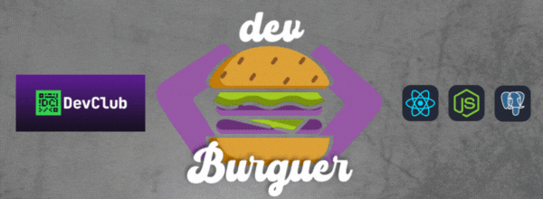

  

# 🍔 Projeto DevBurguer
Projeto final da trilha Full Stack do Dev Club, simulando um sistema de pedidos online para uma hamburgueria. A aplicação conta com frontend em React.js e backend em Node.js, integrados a bancos de dados PostgreSQL e MongoDB, rodando em containers Docker. O sistema possui um usuário administrador e Stripe para pagamento em cartão.

Fotos do Projeto: https://flic.kr/s/aHBqjCvj8e

# 📋 Funcionalidades
- Cadastro e login de usuários
- Listagem e busca de produtos
- Carrinho de compras dinâmico
- Pagamento com cartão de crédito via Stripe
- Autenticação com JWT
- Área administrativa para gerenciar cardápio (CRUD de produtos)
- Integração com banco de dados relacional (PostgreSQL) e não-relacional (MongoDB)
- Deploy com containers Docker

# 🚀 Tecnologias
Frontend: React, Javascript, HTML, CSS;  
Backend: Node.js, Docker e Sripe;  
Banco de Dados: PostgreSQL e MongoDB;

# 📄 Licença
Este projeto está licenciado sob a **MIT License**, permitindo uso, cópia e modificação para fins educativos ou comerciais, sem garantias ou responsabilidades atribuídas ao autor.

# 👨‍💻 Desenvolvedor
Igor Dossin Lazzaretti  
Fã de Harry Potter 🧙  
Linkedin: <a href="https://www.linkedin.com/in/igorlazzaretti/">linkedin.com/in/igorlazzaretti</a>  
Portifólio: <a href="https://igorlazzaretti.com/">igorlazzaretti.com</a>  
Projetos GitHub: <a href="https://github.com/igorlazzaretti?tab=repositories">github.com/igorlazzaretti</a>

###
<!--

:man_technologist: Projeto DevBurguer