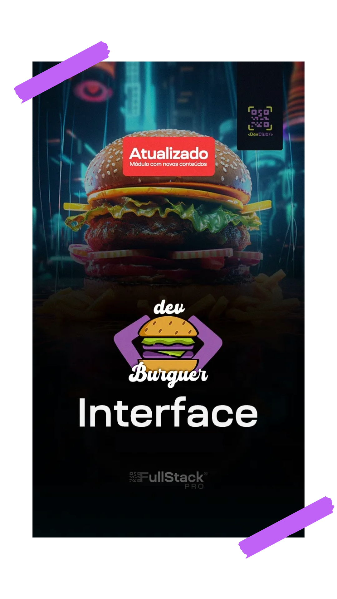

<!-- Commit:
:man_technologist:Interface DevBurguer
Módulo 4 Aula 9 - Terminando Edição de Produtos

Figma: https://www.figma.com/design/iggbPQzl4BsDC0gKKifcwG/DevBurger?node-id=0-1&p=f&t=V6aRzXLheZhpJalg-0
Em Desenvolvimento

ESlint e Prettier. Desistalar extensões do Prettier e utilizar extensão do ESlint
yarn add eslint-config-prettier eslint-plugin-prettier eslint-plugin-import-helpers prettier -D

 -->
## Interface Frontend do DevBurguer

<div align="center">  </div>

Para rodar o projeto digite os comandos: ``` yarn ``` para instalar as dependências locais, e ``` yarn dev``` para rodar o projeto.

## Sobre o Curso

Essa aplicação frontend faz parte do projeto final do curso MBA FullStak do DevClub.

A aplicação tem foco no mercado e, assim, foi desenvolvida utilizando uma variedade de tecnologias modernas para criar uma experiência robusta e escalável. Abaixo estão as principais tecnologias utilizadas:

CSS: usado para a estilização da aparência da página.
<br>Javascript: Permite adicionar interatividade, animações, manipular o conteúdo dinamicamente e responder às ações do usuário.
<br>React: permite criar componentes reutilizáveis, gerenciar o estado da aplicação de forma eficiente e simplificar o desenvolvimento de interfaces complexas.g
<br>Axios: biblioteca Javascript para fazer requisições HTTP.
<br>Styled-Components: uma biblioteca que permite escrever CSS dentro do Javascript.
<br>React-Router-Dom: uma biblioteca para gerenciar rotas em aplicações React.
<br>Reack-Toastify:  uma biblioteca para exibir notificações toast de forma simples e personalizável.
<br>React-Hooks: são funções que permitem usar recursos do React, como estado e ciclo de vida, em componentes funcionais.
<br>Contex-Api: uma forma de compartilhar dados entre componentes React sem precisar passar props explicitamente em cada nível da árvore de componentes.
<br>Prop-Types: uma biblioteca para definir os tipos de dados que um componente React espera receber.
<br>Yup: biblioteca para validação de dados em Javascript
<br>Cors: (Cross-Origin Resource Sharing) é um mecanismo de segurança que permite que um servidor web controle quais sites podem acessar seus recursos.


Backend do projeto: [GitHub](https://github.com/igorlazzaretti/DevBurguer-API.DevClub)

## Sobre o Professor

<div align="center"> 

Sou ex-eletricista do Metrô de São Paulo e fiz a minha transição de carreira graças a programação. Comecei no mercado aos “trancos e barrancos”, estudando no meu tempo livre que tinha nos feriados e fins de semana para me tornar programador.Tomei 13 NÃOs antes de aparecer meu primeiro SIM, mas ele veio – mesmo sem ter faculdade! Meu primeiro emprego foi como programador no Santander, mas também já trabalhei em empresas como BTG Pactual, PI Investimentos e Toro Investimentos.

Hoje o meu propósito é ajudar o máximo de pessoas a transformarem suas vidas por meio da programação. <br><br>

Linkedin: [Rodolfo Mori](https://www.linkedin.com/in/rodolfomori/)

</div>

## Sobre o Curso

A Formação Devclub é a formação mais completa de programação que você já viu, uma vez que você aprende do zero ao avançado para em menos de 06 meses estar atuando como um programador full stack.

A Formação possui mais de 35 módulos e entre eles aulas completas de HTML, CSS, Javascript, Node, Banco de dados, React e muito mais!

Sem contar com as aulas liberadas constantemente como potencializador do seu aprendizado.

<div align="center">  </div>
<div align="center">

Saiba mais sobre: [Youtube do DevClub](https://www.youtube.com/@canaldevclub)

</div>

## Tecnologias Utilizadas

<div align="center">


[](https://skillicons.dev)


</div>

## Sobre o Desenvolvedor
<div align="center">

[](https://git.io/typing-svg)


</div>

🎓 Análise de Sistemas - Cruzeiro do Sul <br>
💻 Estudante FullStack: DevClub / Dio.me<br>
👩🏻‍💻 Autor do Site: <a href="https://igorlazzaretti.com/">igorlazzaretti.com</a> <br>
📚 Leitor e Estudante de Inglês <br>
🧙‍♂️ Fã de Harry Potter  <br> <br>
💾 <a href="https://github.com/igorlazzaretti?tab=repositories">Veja todos meus repositórios</a>  <br>

<div align="center" >

<a href="https://www.linkedin.com/in/igorlazzaretti/"></a>
<a href="https://www.instagram.com/dev.igorlzzrtt/"></a>
<a href="https://api.whatsapp.com/send/?phone=5554999489840&text&type=phone_number&app_absent=0"></a>
<a href="https://www.youtube.com/@idLazzaretti/streams"></a>
<a href="https://linktr.ee/dev.igorlzzrtt"></a>

</div>


##
<div align="center">

> "Acredite nos seus sonhos" <br> - Igor Dossin Lazzaretti

</div>